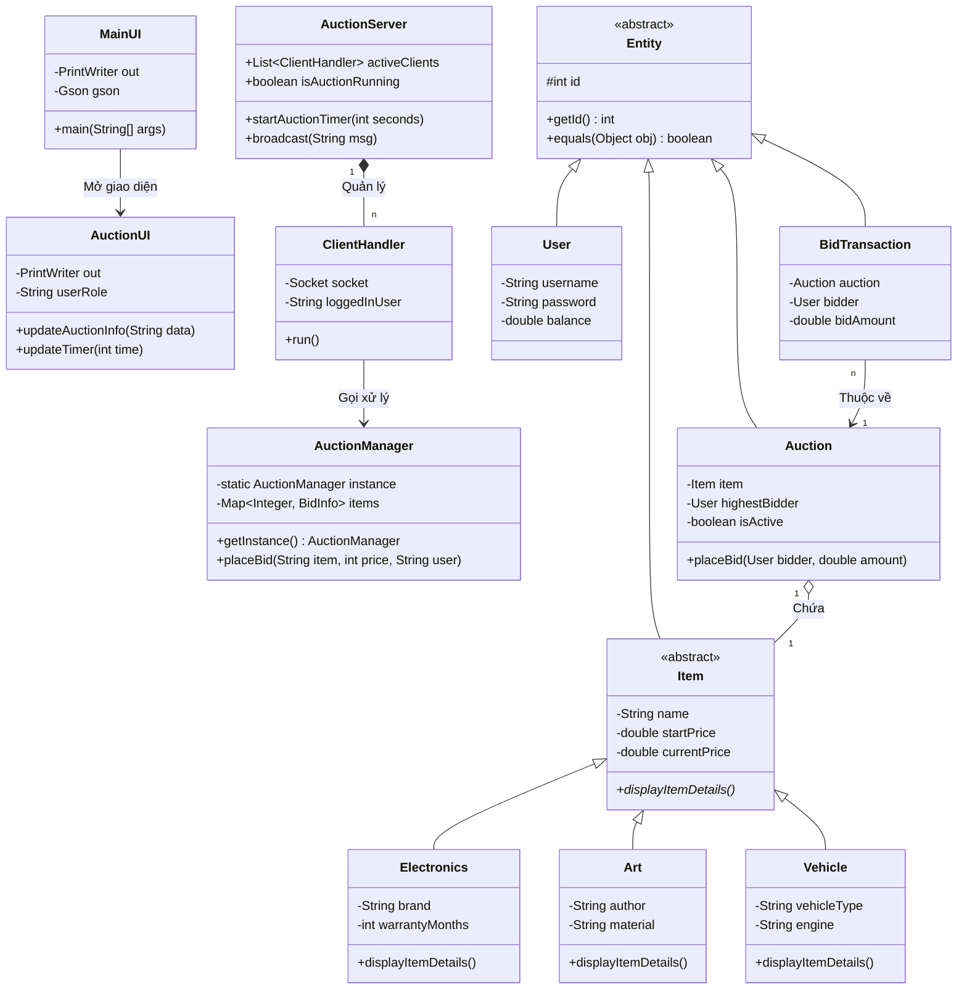

```mermaid
graph LR
    Root[ HỆ THỐNG ĐẤU GIÁ TRỰC TUYẾN]
    
    Root --> N[ Network & Server]
    Root --> B1[ Backend - Core Logic]
    Root --> B2[ Backend - DB & Model]
    Root --> U[ Frontend - UI/UX]

    %% Gán tên thành viên
    N --- N_Name(<b>Lê Hữu Trọng</b>)
    B1 --- B1_Name(<b>Trịnh Đình Quang</b>)
    B2 --- B2_Name(<b>Mai Văn Thuần</b>)
    U --- U_Name(<b>Trần Duy Thái</b>)

    %% Nhiệm vụ Network
    N_Name --> N1[Kiến trúc Socket Client-Server]
    N_Name --> N2[Quản lý kết nối & Đa luồng]
    N_Name --> N3[Xử lý giao thức JSON/Gson]

    %% Nhiệm vụ Backend 1
    B1_Name --> B11[Luồng đồng bộ synchronized]
    B1_Name --> B12[Giải quyết xung đột giá]
    B1_Name --> B13[Hệ thống đếm ngược Timer]

    %% Nhiệm vụ Backend 2
    B2_Name --> B21[Cây kế thừa OOP]
    B2_Name --> B22[Thiết kế MySQL Cloud Railway]
    B2_Name --> B23[Lớp DAO truy xuất dữ liệu]

    %% Nhiệm vụ UI
    U_Name --> U1[Giao diện Java Swing]
    U_Name --> U2[Cập nhật Real-time UI]
    U_Name --> U3[Quản lý trạng thái Client]

    %% CSS Custom cho sơ đồ ngầu hơn
    classDef root fill:#1e1e1e,stroke:#00aaff,stroke-width:2px,color:#fff,font-weight:bold;
    classDef role fill:#2b2b2b,stroke:#ffaa00,stroke-width:2px,color:#fff;
    classDef user fill:#005577,stroke:#00aaff,stroke-width:2px,color:#fff,font-style:italic;
    classDef task fill:#333333,stroke:#555555,stroke-width:1px,color:#ddd;

    class Root root;
    class N,B1,B2,U role;
    class N_Name,B1_Name,B2_Name,U_Name user;
    class N1,N2,N3,B11,B12,B13,B21,B22,B23,U1,U2,U3 task;```
